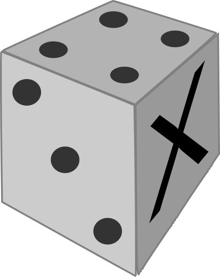

 

# Jogo de DadoX

Projeto de script que simula um Jogo de dados em Python 3 onde é definido o lado a ser apostado (_1, 2, 3, 4, 5 e 6_) e número de jogadas (_1, 3, 5 e 7_) ou se vai ser um número par ou ímpar, pontuando os acertos e exibindo se o jogador ganhou ou perdeu. 

## Tecnologias

- Python

## Créditos

- [Estênio Mariano](https://github.com/emso-exe)

## Licença

Licença MIT (MIT). Por favor leia o [arquivo da licença](LICENSE.md) para mais informações.